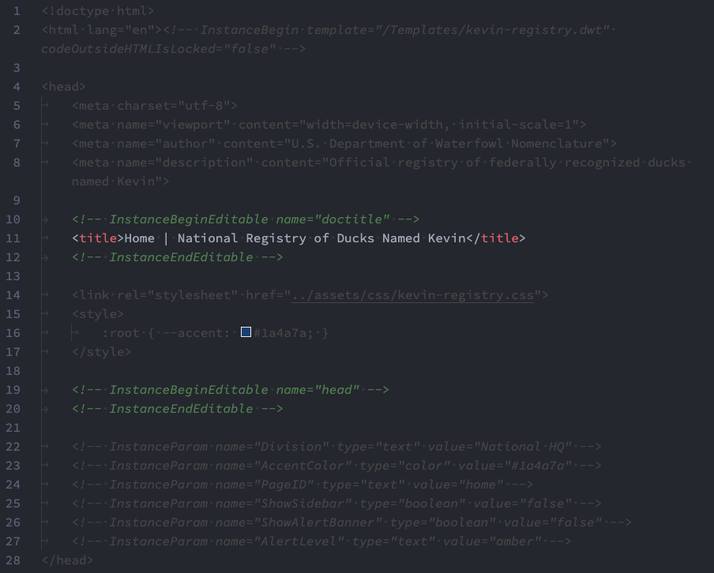
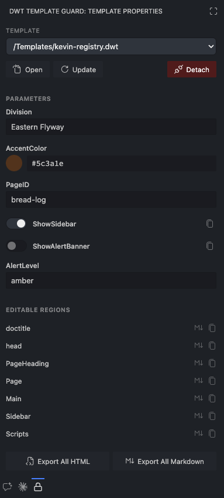

# Dreamweaver Template Guard

Ever opened a Dreamweaver template instance in VS Code, made a quick edit, and accidentally nuked the surrounding template markup?

Yeeeeah. This extension puts a stop to that.

It automatically detects template-locked regions in your HTML files and quietly blocks edits to them — so you can work freely inside editable regions without accidentally touching anything you shouldn't.

## Features

### 🔒 Edit Protection

Open any Dreamweaver template instance (an HTML file with `<!-- InstanceBegin -->` markers) and the extension immediately cordons off the locked regions.

Try to sneak an edit in there and it'll be instantly reverted — no harm done, no drama. An optional warning message will politely explain what happened.

The `.dwt` template source files themselves are always freely editable, because obviously.

### Visual Highlighting

No more squinting at your markup trying to figure out what's safe to edit:

- **Locked regions** are visually dimmed — they fade back like they know they're not supposed to be touched
- **Editable region markers** (`<!-- InstanceBeginEditable -->` / `<!-- InstanceEndEditable -->`) are highlighted in green italic, so they pop right out
- Colors automatically adapt to light, dark, and high-contrast themes, because we don't play favorites



### 🎛️ Template Properties Panel

Remember Dreamweaver's Template Properties panel? Well, we did that too! This dedicated sidebar that gives you full control over the active file's template without ever leaving VS Code.

To open it, simply click the **DWT Template Guard** lock icon in the Activity Bar.

- **Switch templates** &mdash; swap the page to a different `.dwt` file from a dropdown (great for when someone picked the wrong template three months ago)
- **Edit parameters** &mdash; update template parameters (text, color, toggle, number, URL) with purpose-built controls like color swatches and toggle switches
- **Jump to regions** &mdash; click any editable region in the list to navigate directly to it, or copy its content as HTML or Markdown
- **Template actions** &mdash; open the source template, re-apply it with updated values, or detach the page from the template entirely (for when it's time to go solo)
- **Export** &mdash; save all editable regions to a new HTML or Markdown file



When you update a parameter, the extension instantly re-applies the template — resolving `@@(paramName)@@` expressions and `<!-- TemplateBeginIf -->` conditionals — while leaving your editable region content completely untouched.

### Full DWT Language Support

`.dwt` files get treated as their own language with proper HTML syntax highlighting. Dreamweaver template expressions like `@@(Division)@@` won't trigger false syntax errors in VS Code — no more red squiggles on perfectly valid template code.

Emmet abbreviations work just like they do in regular HTML files, too.

### Commands

All commands are available from the Command Palette (`Ctrl+Shift+P` / `Cmd+Shift+P`), the editor right-click menu, and the editor tab context menu:

| Command | Description |
|---------|-------------|
| **DWT Guard: Show Editable Regions** | Pick from a list of all editable regions and jump to one |
| **DWT Guard: Toggle Protection** | Temporarily turn protection on or off for the current file |
| **DWT Guard: Open Template Properties** | Open the Template Properties sidebar panel |

## Configuration

All settings live under **Settings → Extensions → Dreamweaver Template Guard** (or just search "DWT Guard" in VS Code settings — it's faster).

| Setting | Default | Description |
|---------|---------|-------------|
| Enable Protection | On | Revert edits made inside locked template regions |
| Enable Highlighting | On | Dim locked regions so editable areas stand out |
| Show Warnings | On | Display a message when an edit is blocked |
| Protected Region Color | *(theme default)* | Override the text color of locked regions with a custom hex value (e.g. `#555555`) |
| Protected Region Background | *(none)* | Add a background color to locked regions |
| Active File Types | `html, htm, dwt, php, asp, csp` | File extensions the extension keeps an eye on |
| Warning Message | *(default)* | Customize the message shown when an edit is blocked |

## 🎨 Customizing Colors

Using a custom VS Code color theme? You can override the extension's highlight colors in your `settings.json`:

```json
"workbench.colorCustomizations": {
    "dwtTemplateGuard.protectedRegionForeground": "#555555",
    "dwtTemplateGuard.markerColor": "#2e7d32"
}
```

- **`protectedRegionForeground`** &mdash; text color for locked/protected regions
- **`markerColor`** &mdash; text color for the editable region marker comments
