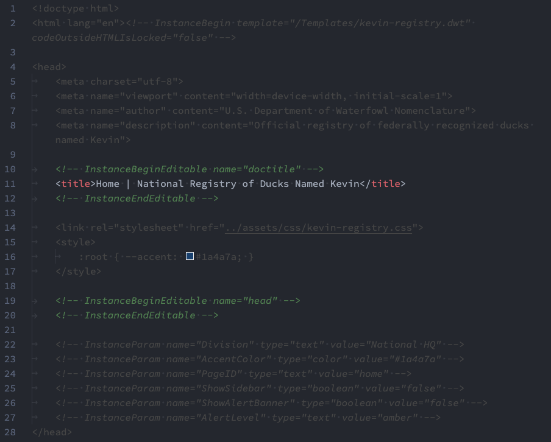
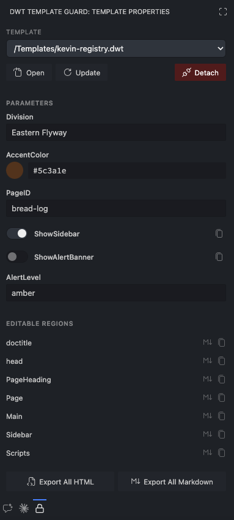
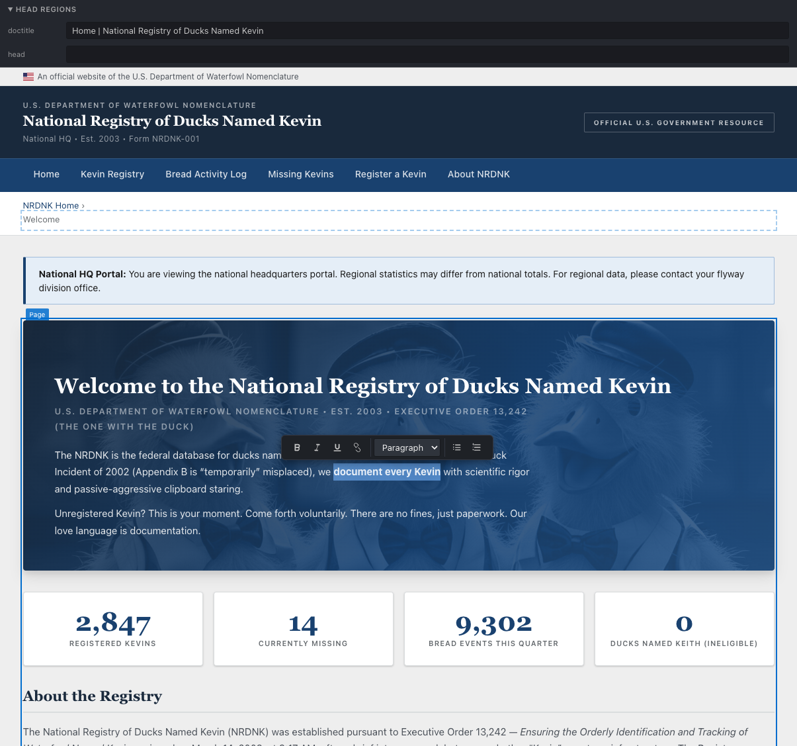

# Dreamweaver Template Guard

Still using Dreamweaver templates? That's not legacy code — that's heritage. DWT Guard brings `.dwt` + `.lbi` workflows into VS Code so you can stop paying Adobe rent to edit angle brackets.

The core features you relied on in Dreamweaver (like protected regions, template propagation, library items) are all here, just without the preview that takes a coffee break every time you save.

## What's in the box

### Template protection

Protected regions are protected. Type where you shouldn't and this extension reverts your keystrokes.

### Editable regions you can actually see

Locked regions dim and editable markers pop, regardless of whether you're on a light, dark, or high-contrast theme.



### Template Properties panel

- Edit parameters (text, colors, toggles, URLs).
- Swap which `.dwt` a page uses.
- Jump to editable regions or export them as HTML/Markdown.



*One sidebar for parameters, region navigation, and template actions. No menu archaeology required.*

### Visual Editor (now without the loading spinner)

- Live preview rendered with your actual site CSS faster than Dreamweaver.
- Click into editable regions to edit them. Locked regions ignore you, as they should.
- Formatting toolbar for bold/italic/underline/link + headings.



*A live preview where only editable regions respond to clicks. A small formatting toolbar appears when you select text. That's it. No surprises.*

### Template propagation + library sync

- Save a `.dwt` → pick which pages to update → watch the progress bar do its thing.
- Save a `.lbi` → every `#BeginLibraryItem` block updates automatically.
- Same propagation you know from Dreamweaver, same reliability, zero Creative Cloud.

### Dependency tree

- See every template and every page attached to it, in one view.

## Commands

| Command | What it does |
|---|---|
| **DWT Guard: Show Editable Regions** | Find and jump to editable regions |
| **DWT Guard: Toggle Protection** | Live dangerously (or stop) |
| **DWT Guard: Template Properties** | Open the sidebar panel |
| **DWT Guard: Open Visual Editor** | Open the live preview editor |
| **DWT Guard: New File from Template** | Create a new page from a template |
| **DWT Guard: Export Instances to Static HTML** | Export clean HTML with no template markers |
| **DWT Guard: Refresh Dependency Tree** | Refresh the template → pages tree |

## Settings

| Setting | What it does |
|---|---|
| **Enable Protection** | Turn locked-region enforcement on or off |
| **Enable Highlighting** | Dim locked regions, highlight editable ones |
| **Show Warnings** | Show a message when an edit gets blocked |
| **Enable Code Lens** | Add a quick "Open Template" link above instances |

## Theme color overrides

```json
"workbench.colorCustomizations": {
  "dwtTemplateGuard.protectedRegionForeground": "#555555",
  "dwtTemplateGuard.markerColor": "#2e7d32"
}
```
